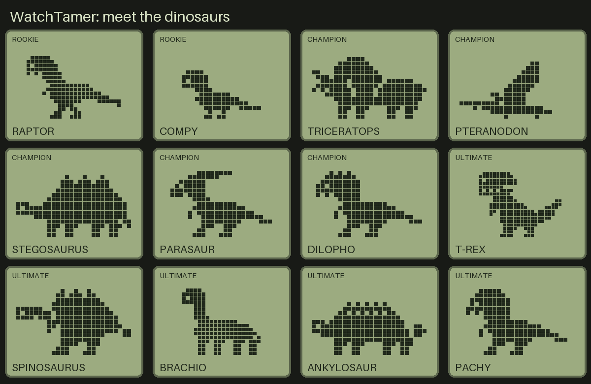
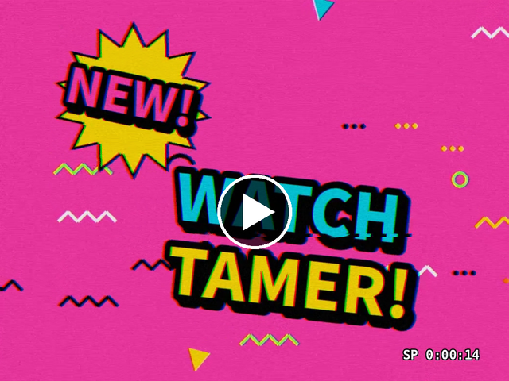
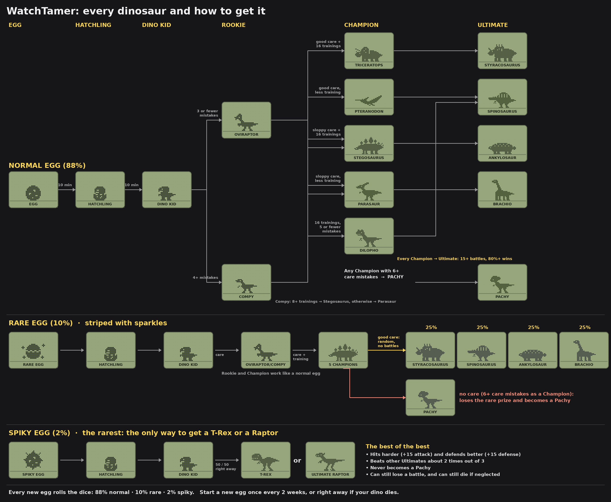

# WatchTamer 🦖

A classic 90s-style virtual pet for Apple Watch, the kind you raised on a keychain and then plugged into a friend's to battle. It uses a dot-matrix LCD, icon menus and a dinosaur that grows from a tiny egg into a mighty Ultimate.



## Watch the commercial

[](docs/WatchTamer-commercial.mp4)

A 40-second, 90s-style TV commercial for the game. Click the picture to play it.

## Requirements

- Apple Watch running **watchOS 26.4** or later
- **Xcode 26.4** or later on a Mac, to build and install it
- No iPhone app, account or internet connection needed

## Build & run

1. Open `WatchTamer.xcodeproj` in Xcode.
2. Select the target **WatchTamer Watch App** → **Signing & Capabilities** → choose your own **Team** (a free Apple ID works for your own watch).
3. Pick your Apple Watch (or a watch simulator) at the top of the window and press **▶ Run**.
4. On first launch, allow **Motion & Fitness** (for walk training) and **Notifications** (for care reminders).

Builds run from Xcode include a **Testing** section in Settings (skip time, add steps, evolve now, make sick, pretend 14 days away, lay a rare or spiky egg). App Store and TestFlight builds leave it out automatically.

## How to play

| Icon | What it does |
| --- | --- |
| ⚖️ **Status** | Tap through 6 pages: form & age, hunger hearts, strength hearts, effort, battle record (wins and losses), care |
| 🍴 **Feed** | **Meat** = +1 hunger heart (+1g). **Protein** = +1 strength heart (+2g) |
| 🏋️ **Train** | **TAP**: mash the screen for 5 seconds to fill the meter. **WALK**: just walk; every 250 steps (adjustable) counts as a training rep, even while the app is closed |
| ⚡ **Battle** | **CPU**: fight a computer rival. **FRIEND**: swap battle codes (see below). First to 3 hits wins. Rookie and up |
| 🌊 **Flush** | Clean up poop. 8 piles = your dino gets sick |
| 💡 **Lights** | Bedtime starts at 8–10pm (by stage). **Light off** = your dino sleeps and its needs pause. **Light on** = it wakes up, so you can feed, train, battle, clean and heal any time of day or night. Leave the game during bedtime and the light switches off by itself. |
| ➕ **Medicine** | Cure sickness and battle injuries (skull icon) |
| ⚠️ **Call** | Blinks when your dino needs you. Ignore it for 10 minutes = 1 care mistake |

**Notifications:** when the app is closed, your watch alerts you when your dino gets hungry 🍖, weak 💪, poops 💩 (each pile, with a warning before it gets sick), or gets sick 💀. Each type can be switched off in Settings. You also get a warning 2 days and 1 day before the 2-week limit below.

**Time never stops.** Like the 90s toys, the game always runs in real time, with no pause and no fast-forward.
- **Short breaks are safe:** while the app is closed, your dino can get hungry or sick, but it can't die. It waits for you, and after you come back you get at least an hour to fix things.
- **Don't abandon it:** if you don't open WatchTamer for **2 weeks in a row**, your dino dies of loneliness.

Swipe left for **Settings**: night screen, notification switches, walk training and steps per rep.

## Battling a friend (battle codes)

1. Both players tap ⚡ → **FRIEND**. Each watch shows a code like `H5N-9QP`, a snapshot of that dino.
2. Tap the screen to open code entry, then tap the text box to type your friend's code (keyboard, Scribble or dictation) while they type yours. Tap **⚡ BATTLE!**
3. Both watches play out the **same fight** with the same winner, with no internet or pairing needed.

Codes refresh after every battle, so swap new ones for a rematch. Use **NEW CODE** on the entry screen to make a fresh one. Mistyped codes are rejected before the battle starts.

## Eggs and evolution



**Every new egg rolls the dice:**

| Egg | Chance | What's inside |
| --- | --- | --- |
| Normal (spotted) | 88% | Care, training and battles decide (chart above) |
| Rare (striped, with sparkles) | 10% | Grows like a normal egg, then becomes a random Ultimate (Styracosaurus, Spinosaurus, Ankylosaur or Brachio, 25% each) with no battles needed, and a little stronger in battle (+8 attack and defense). Neglect it as a Champion (6+ care mistakes) and it becomes a Pachy |
| Spiky | 2% | The rarest. Goes straight from Dino Kid to **T-Rex** or **Raptor** (50/50) |

**T-Rex and Raptor only come from the spiky egg.** They're the best of the best: +15 attack and +15 defense in every battle (CPU and friend), so they beat other Ultimates about 2 times out of 3. A rare egg's Ultimate sits in between with +8 (Pachy gets no bonus). They never become a Pachy, but they can still lose and can still die if neglected.

**Normal egg path:**

```
Egg → Hatchling → Dino Kid ─┬─ (≤3 mistakes) Oviraptor ─┬─ good care + 16 trainings → Triceratops ─→ STYRACOSAURUS
                            │                            ├─ good care, less training → Pteranodon ──→ SPINOSAURUS
                            │                            ├─ sloppy care + training ──→ Stegosaurus ─→ ANKYLOSAUR
                            │                            └─ sloppy care, no training → Parasaur ────→ BRACHIO
                            └─ (4+ mistakes) Compy ──────┬─ 16 trainings, ≤5 mistakes → Dilophosaurus → SPINOSAURUS
                                                         ├─ 8+ trainings ────────────→ Stegosaurus
                                                         └─ otherwise ───────────────→ Parasaur
Champion → Ultimate needs 15+ battles with an 80%+ win rate at that stage.
6+ care mistakes as a Champion → Pachy.
```

How long each stage lasts: Egg 10 min · Hatchling 10 min · Dino Kid 6 h · Rookie 24 h · Champion 36 h (a normal egg then evolves once it meets the battle goal). A spiky egg reaches its T-Rex or Raptor in about 6 hours 20 minutes.

**Fair play:** **Start new egg** (in Settings) can be used once every 2 weeks, so you can't keep restarting to fish for a spiky egg. Keep your dino as long as you like; if it dies, you get a new egg right away.

## Project layout

- `PetModel.swift`: all game rules (pure, minute-by-minute simulation)
- `DinoState.swift`: live game: clock, actions, battles, training, step counting, saves, reminders
- `ContentView.swift`: the device screen (icons + LCD)
- `DinoSpriteView.swift`: LCD palette and pixel renderer
- `PixelArt.swift`: all dinosaur and icon sprites as dot-matrix art
- `BattleCode.swift`: friend battle codes and the shared, seeded fight
- `SettingsView.swift`: settings, help and testing tools
- `docs/dinosaurs.png` and `docs/evolution.png`: the pictures in this README
- `docs/WatchTamer-commercial.mp4`: the 90s-style commercial

## Privacy

WatchTamer has no accounts, ads, analytics or network code. Your dino, your settings and your step count stay on your watch. Step data is only read to turn walking into training; it is never sent anywhere. For the App Store privacy label, this app is **Data Not Collected**.

## Author

Created by Senalbert Rodriguez.

## License

WatchTamer is free and open source under the [MIT License](LICENSE). You're welcome to play it, learn from it, change it and share it. Just keep the copyright notice.
